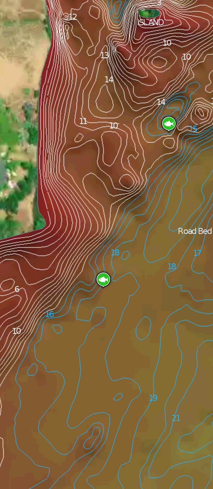

Kayak fishing off point due south of Bay Loop at Steamboat Rock State Park, in 18' deep water at base of slope down to old road bed. Caught using Ned rig: Z-Man Finesse TRD stickbait on 1/10 oz jighead. 

