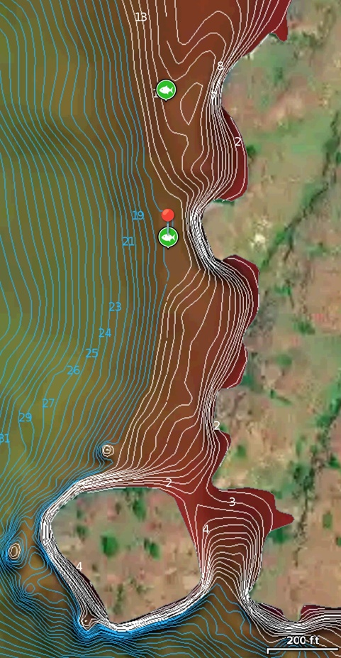

Kayak fishing on west side of rocks on north shore of Banks lake, due north across lake from channel exiting Devil's Punch bowl at Steamboat Rock State Park. In 15' deep water on bench at base of cliff. Caught using scented fluke: Berkely PowerBait Power Jerk Shad on Owner Twistlock 5/0 centering pin hook with BaitPop Elite Crawfish Red Scent.

