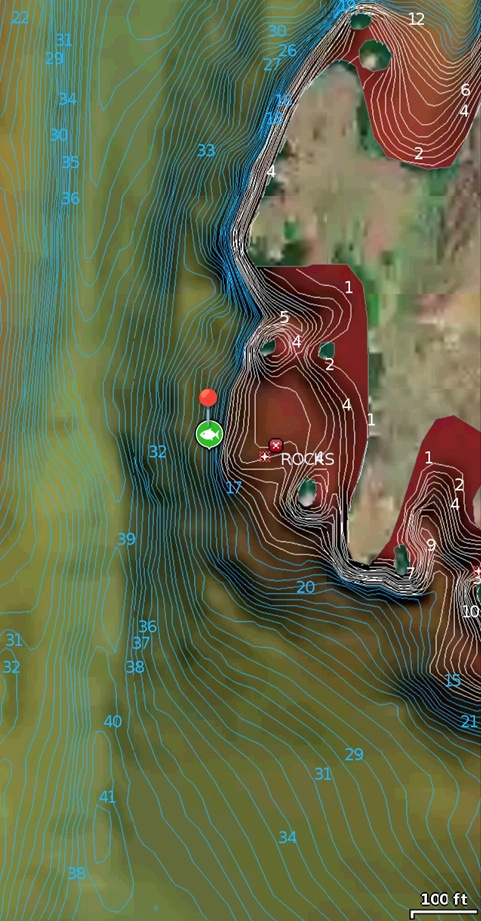

Kayak fishing off rocks on east side of channel exiting the north end of Devil's Punch Bowl, northwest of Steamboat Rock boat ramp. In 18' deep water along steep slope. Caught using Ned rig: Z-Man Finesse TRD stickbait on 1/10 oz jighead. 

